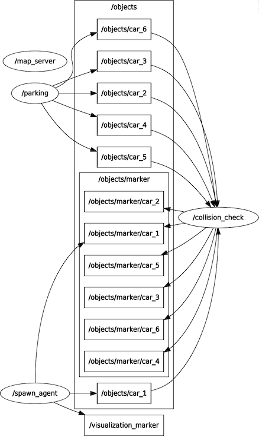

# Spawn_agent.py 코드 설명
> 기본 제공된 코드는 제외

## Trajectory를위한 변수 설정
```python
traj_xs = waypoints["x"]
traj_ys = waypoints["y"]
traj_yaws = waypoints["yaw"]
```

- 경로 추적을 위해 waypoint 정보들이 저장되어 있는 변수인\
waypoint dictinary 변수를 키 값을 기준으로 x, y, yaw 변수로 저장

## 전체 경로에 대한 정보를 Frenet Frame 좌표(s-d 좌표)로 변환
```python
# maps 변수 경로의 크기만큼 초기화
maps = np.zeros(traj_xs.shape)
# 경로의 크기만큼 반복문을 수행하여 전체 경로에 대해
# x, y 좌표를 s-d 좌표로 변환
for i in range(len(traj_xs)-1):
    x = traj_xs[i]
    y = traj_ys[i]
    sd = get_frenet(x, y, traj_xs, traj_ys)
    maps[i] = sd[0]
```

- 예제 코드에서는 반복문을 수행할 때, traj_xs 크기만큼 수행하여도 문제가 없었으나,\
본 과제에서는 크기에 대한 오류가 발생하여 크기를 1 빼줌
- 이 문제에 대해 이유를 모르겠음

## 차량의 현재 위치에 대한 s-d 좌표 초기화
```python
# initial condition, convert global coordinate to frenet coordinate
s, d = get_frenet(state.x, state.y, traj_xs, traj_ys);
x, y, yaw_road = get_cartesian(s, d, traj_xs, traj_ys, maps)
yawi = state.yaw - yaw_road

# s 방향 초기조건
si = s
si_d = state.v*np.cos(yawi)
si_dd = 0
sf_d = target_speed
sf_dd = 0

# d 방향 초기조건
di = d
di_d = state.v*np.sin(yawi)
di_dd = 0
df_d = 0
df_dd = 0

# Optimal d 방향 초기 조건
opt_d = di
```

## 장애물 좌표
```python
obs = np.array([
    # 첫번째 장애물
    [148, 0.567],
    [151, 0.567],
    [156, 0.567],
    # 두번째 장애물
    [229, -1.13],
    [232, -1.13],
    [235, -1.13],
    # 3번째 장애물
    [103, 1.3],
    [106, 1.3],
    [109, 1.3],
    # 4번째 장애물
    [299, 0.5],
    [302, 0.5],
    [305, 0.5],
    # 5번째 장애물
    [350, 0.6],
    [353, 0.6],
    [356, 0.6]
])
```

- 장애물 2개에서 5개로 늘려서 과제 수행
- d 좌표는 차의 너비에 따른 전체 좌표 중 적절히 한 군데만 설정해도 크게 문제는 없었으나,
- s 좌표의 경우에는 속도에 따라서 회피하는 경우와 그렇지 못 한 경우가 발생하여\
적절한 크기로 좌표 설정을 함
- 차량의 크기에 맞춰서 3등분 하여 반복문으로 좌표를 설정해보려 했으나, 이상하게 이 반복문만 들어가면 시뮬레이션이 굉장히 느려져서\
설정안함, 그다지 큰 계산도 아닌데 왜 그런지 모르겠음
- 현재 설정된 위치는 정확히 3등분 된 것은 아니고, 차량의 약 중점과 가장 끝부분 그리고 탈출 시 후미 부분의 충돌을 피하기 위해\
여유 공간을 주기 위한 좌표로 설정함 

> 아래의 코드들은 `while not rospy.is_shutdown():` 반복문 아래의 내용임
## Frenet frame에서 optimal 경로 확인 및 생성
```python
path, opt_ind = frenet_optimal_planning(si, si_d, si_dd, sf_d, sf_dd, di, di_d, di_dd, df_d, df_dd, obs, traj_xs, traj_ys, maps, opt_d)
```

- frenet frame 상에서 경로 확인과 생성을 위해\
`optimal_trajectory_Frenet.py`에서 가져온 함수
- 상세 코드 내용은 뒤에 설명

## 경로를 따라가기 위한 steering angle과 가속도 변수 설정 
```python
# generate acceleration ai, and steering di
speed_error = target_speed - state.v
ai = speed_error / 0.01

delta = stanley_control(state.x, state.y, state.yaw, state.v, path[opt_ind].x, path[opt_ind].y, path[opt_ind].yaw)
```

- 현재의 state.x/y/yaw 와 optimal planning으로 생성된 path를 기반으로 경로 추적을 위한 stanley method 수행
- 'stanley.py'에서 가져온 함수
- target_speed = 20
- 설정된 target_speed와 현재 속도인 state.v로부터 speed error 계산
- 계산된 speed_error 부터 dt (= 0.01)를 나누어 가속도 계산

## 차량의 현재 정보에 대한 topic의 message 생성
```python
# vehicle state --> topic msg
msg = get_ros_msg(path[opt_ind].x[0], path[opt_ind].y[0], path[opt_ind].yaw[0], state.v, id=id)
```

- x, y 좌표와 방향 yaw 그리고 속도 정보에 대한 message 생성

## 경로 정보에 대한 시각화
```python
# path state --> topic msg
path_msg = get_path_msg(path, opt_ind)
```

- planning의 결과로 생성된 경로를 시각화하기 위한 메세지 생성
- 함수 내용
    ```python
    def get_path_msg(path, opt_ind):
        markerarray = MarkerArray()

        for id, fp in enumerate(path):
            marker = Marker()
            marker.id = id
            marker.header.frame_id = "map"
            marker.type = marker.POINTS
            marker.action = marker.ADD

            if id == opt_ind:
                marker.color.r = 1.0
                marker.color.g = 0.0
                marker.color.b = 0.0
                marker.color.a = 1.0

                marker.scale.x = 0.5
                marker.scale.y = 0.5

            else:
                marker.color.r = 0.0
                marker.color.g = 1.0
                marker.color.b = 0.0
                marker.color.a = 0.5

                marker.scale.x = 0.25
                marker.scale.y = 0.25

            for x, y in zip(fp.x, fp.y):
                point = Point()
                #point.x = x  + 1.3 * math.cos(fp.yaw[id])
                #point.y = y  + 1.3 * math.sin(fp.yaw[id])
                point.x = x
                point.y = y
                marker.points.append(point)

            markerarray.markers.append(marker)

        return markerarray
    ```
- optimal path는 빨간색으로 표시
- 나머지는 녹색으로 표시

## 변수 갱신
```python
# update state with acc, delta
state.update(ai, delta)

# update frenet variable
si = path[0].s[1]
si_d = path[0].s_d[1]
si_dd = path[0].s_dd[1]
di = path[0].d[1]
di_d = path[0].d_d[1]
di_dd = path[0].d_dd[1]

# consistency cost를 위해 update
opt_d = path[opt_ind].d[-1]
```

- 차량의 현재 상태를 나타내는 변수인 state 변수 갱신
- frenet frame에서의 상태를 나타내기 위한 변수들 갱신

## Topic 발행
```python
# send tf
tf_broadcaster.sendTransform(
    (path[opt_ind].x[0], path[opt_ind].y[0], path[opt_ind].yaw[0]),
    msg["quaternion"],
    rospy.Time.now(),
    "/car_" + str(id), "map"
)

# publish vehicle state in ros msg
object_pub.publish(msg["object_msg"])
path_marker_pub.publish(path_msg)
```

- optimal path를 기준으로 rviz에서의 차량 표시를 위해 quaternion
좌표로 변환
- 차량 정보에 대한 topic과 경로의 시각화를 위한 topic 발행

# optimal_trajectory_Frenet.py 코드 설명
> 기본 코드에서 수정한 내용만 설명

## `def calc_frenet_paths`
```python
def calc_frenet_paths(si, si_d, si_dd, sf_d, sf_dd, di, di_d, di_dd, df_d, df_dd, opt_d):
    LANE_WIDTH = 3.9  # lane width [m]   
    # lateral planning 시 terminal position condition 후보
    DF_SET = np.array([LANE_WIDTH/3.0, -LANE_WIDTH/3.0])

    MIN_T = 1.0 # minimum terminal time [s]
    MAX_T = 2.0 # maximum terminal time [s]
    DT_T = 0.2 # dt for terminal time [s] : MIN_T 에서 MAX_T 로 어떤 dt 로 늘려갈지를 나타냄
    DT = 0.1 # timestep for update

    # cost weights
    K_J = 0.1 # weight for jerk
    K_T = 0.1 # weight for terminal time
    K_D = 1.0 # weight for consistency
    K_V = 1.0 # weight for getting to target speed
    K_LAT = 1.0 # weight for lateral direction
    K_LON = 1.0 # weight for longitudinal direction
```

- 차폭은 3.9 m 로 rviz 상의 모형차 너비의 2배 조금 넘는 크기로 설정
- lateral condition을 3등분함
- 함수 계산을 위한 time의 범위는 위와 같음

## `def collision_check`
```python
def collision_check(fp, obs, mapx, mapy, maps):
    COL_CHECK = 1.0  # collision check distance [m] 0.25
```

- collision check를 위한 범위는 1 m 로 설정

## `def check_path`
```python
def check_path(fplist, obs, mapx, mapy, maps):
    V_MAX = 20       # maximum velocity [m/s]
    ACC_MAX = 100     # maximum acceleration [m/ss]
    K_MAX = 50       # maximum curvature [1/m]
```

- 최적 경로 도출을 위한 속도, 가속도, 회전 곡률에 대한 한계치들에 대한 설정
- 속도 한계치는 target_speed가 20 m/s 이기 때문에 20으로 설정
- 가속도와 회전 곡률은 임의로 지정\
(최대한 가속도와 곡률로 인해 경로 check에 걸리지 않도록...)


# Result

[](https://youtu.be/TCZSvqqE8eo)

# 고찰
- 주행 시 차선의 가장 끝이 optimal하다고 계산이 되서 한쪽으로 치우쳐져 주행을 하는 것 같은데\
stanley method로 tracking만 할 때 처럼 reference path인 노랑색 경로를 중심으로\
아무것도 없을 때의 optimal path로 설정할 수 있는 방법이 있나 궁금함
    - if 문으로 check된 path의 경로에 따라 경우를 나눠보려 했지만 안되었음

- 또한 lateral condition을 위한 차선을 3 이상으로 더 세세하게 나누어 보았으나,\
회피를 하는 각도가 너무 작아 계속 장애물에 부딪치게 되어 적당하게 3 등분 하였음
- 가중치에 변화를 주면 더 세세하게 나눴을 때 장애물의 상태에 따라 각도를 많이 꺽거나 적게 꺽을 줄 알았는데 그러지 않았음
    - 어떻게 하면 경로 후보를 세세하게 주어서 그 중 한 가지를 선택할 수 있도록 할 수 있는지 궁금함
